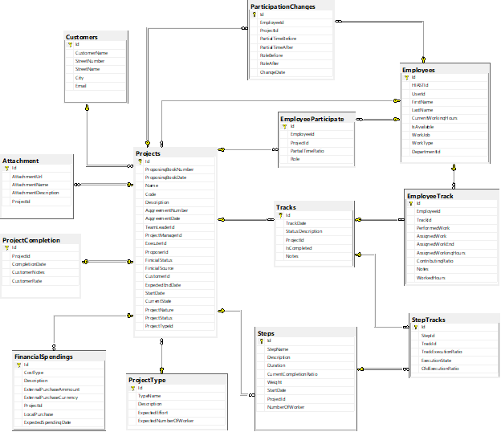
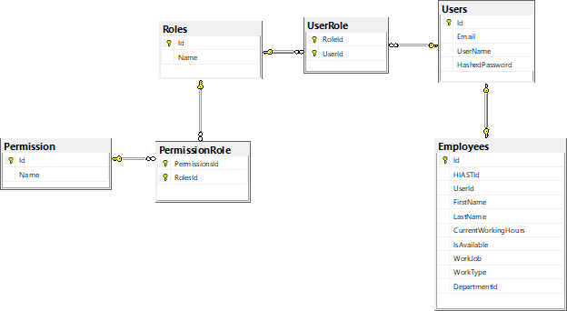
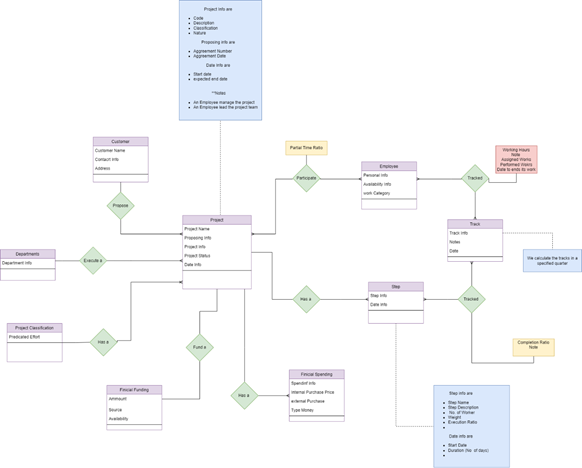

### تتبع حالة المشاريع

> نهف في هذا الملف إلى تقديم صورة عامة عما فعلناه
___
### لمحة عامة وموارد مفيدة

يوجد في الفصل الثالث أي فصل آلية إدارة المشاريع الفقرة الثالثة 3.3 فقرة إجرائيات إدارة المشاريع في المعهد العالي نتحدث فيها عن آلية سير العمل القديمة.

 يوجد في الفصل السابع أي فصل تصميم النظام الفقرة الأولى سرح لمبادئ التصميم المتبعة وفيها نبين مالدينا من مجالالت ضمن النظام 
 
 يوجد في المرفقات  ملف حالالت الاستخدام كملف PDFقطعة واحدة مجردة

 إن الفصل السادس أي فصل الأنماط التصمميمية يوضح جميع الأماط التصميمية المستخجمة في تنجي النظام.

إن الفقرة 3.5 مدخلات ومخرجات النظام من الفصل الخامس أي فصل الدراسة التحليلية تبين الاستمارات والاوراق التي يتم التعامل بها حاليا في اجرائية إدارة المشاريع في المعهد.

يوجد في فصل التنجيز أي الفصل التاسع بند مشروع مداومة البيانات في فقرة البنية التحتية مخططين الأول لقاعدة المعطيات المتعلقة بمجال التطبيق  والثاني مخطط لإدارة الأدوار والصلاحيات.

___
## البنية المستخدمة 
يوضح الشكل أدناه البنية العامة لللتصيم المقترح للنظام
وعليه نبين أننا استخدمنا البينة المعمارية النظيفة وبعض مبادئ التصميم المقاد بالمجال في تصميم طرف الواجهة الخلفية
كما  استخدمنا نمطا يسم التصميم القائم على التقسيم إلى ميزات (Featuer-Based Decomposition) في تطوير تطبيق الواجهة الأمامية

___
### آلية عمل الزبون في التطبيق بشكل مقتضب 
يقوم السيد الوكيل العلمي بطرح مشروع ويتسطيع الاطلاع على عمليات المتابعة المكتملة وغير المكتملة
ويستكيع المخططون إضافة جهات طارح وتعريف أنواع المشاريع

يستطيع مدراء المشاريع ورؤساء فرق العمل بالاطلاع على المشاريع إدارة خطة الانفاق , المرفقات, المراحل   
ويستطيعون نقل المشروع  بين أطواره المختلفة (طور متابعة ,طور تخطيط, طور تسليم , طور إلغاء...) 

يستطيع الموظف لاطلاع على سماهماته في المشاريع ةتاريخ تبجلاته

يوجد عدد من التقارير التي استكعنا توليدها وهنالك تقارير جديدة لم تكن موجودة استطعنا إضافتها.

___

### مكونات النظام
يتكون النظام من طرف الوجهة الخلفية Back end تم تكويره باستخدم asp net core 5
مع قاعدة بيانات من نوع SQL Server  
ومن طرف الواجهة لامامية Frontend تم تكويره بإطار Angular  

___
### مخطط قاعدة البيانات

مخطط قاعدة المعطيات

مخطط إدارة الأدوار والصلاحيات

مخطط العلاقات بين الكائنات 

> ملاحظة هامة هذا المخطط أي مخطط العلاقات بين الكائنات قد يحوي بعض الفاهيم التي ليس موجودة في مخطط قاعدة المعطيات والعكس كذلك لأننا رسمناه قبل الانتهاء من تحليل المسألة وعندما انتهينا منها اتضح لنا طبيعةا لنظام كاملة ولكن لم يسعفنا الوقت لإعادة تصحيحه لذلك أضعه لأنه قد يساعد على فهم المسألة.

___

### بعض المخططات المفيدة 
مخطط المفاهيم وارتباطاتها

مخطط أطوار المشروع والتبدلات بينها 

___
### مما تتكون هذه المكونات؟
يوجد ملف باسم FRONTENDREADMR.MD يوثق طرف الواجهة الأمامية وآخر باسم BACKENDREADME.MD يوثق طرف المخدم
___
تجد هنا عزيزي القارئ روابط مهمة ومفيدة:
1.  [مشروع طرف الواجهة الخلفية على git.hiast.edu.sy]([https://git.hiast.edu.sy/hasan.bahjat/projectsstatusmanagement.git])

2. [مشروع طرف الواجهة الأمامية على git.hiast.edu.sy](https://git.hiast.edu.sy/hasan.bahjat/psmanagementui.git)

3. [مقالة مفيدة عن CQRS](https://martinfowler.com/bliki/CQRS.html)
